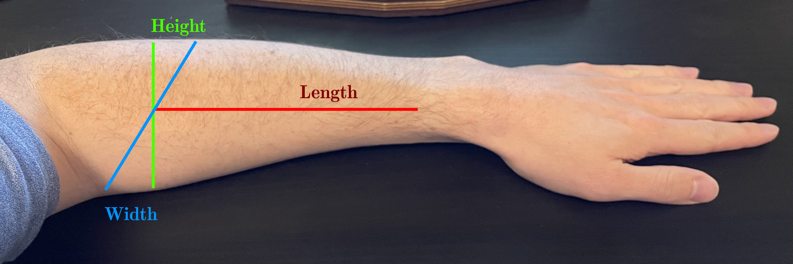

# Arm Brace with Platform
OpenSCAD model of arm brace

## Status
First steps in first rough cut of arm brace off of user input measurements.

STL files are created from notional arm measurements of:

Arm length in inches = 5 3/4;

Arm Width at Elbow in Inches = 3;
Arm Width at Wrist in Inches = 2.5;

Arm Height at Elbow in Inches = 2 3/4;
Arm Height at Wrist in Inches = 1 5/8;

Printed with a 1mm wall between arm and strap. This was not really thick enough.

Now the arm-brace-lower.stl has a 2mm wall but has not yet been printed.

Prusa Slicer gives the following info for bottom brace (larger, with 45% circular arm coverage):
75g at 30% cubic infill.
Would take about 6.75 hours to print at 0.24mm layer heights and have a 92.8 x 38.75 x 146.2 mm print area.

Most 1.75mm diameter filament spools are 1kg for about $25, so it would only cost about $1.87 to print this. Even less for smaller braces.

## Measurement Descriptions & Picture
Measurements are taken from an arm laying along a table with palm and elbow on table.

Length is along the elbow to wrist axis.
Width is along the pinky to thumb axis.
Height is along the palm to back of hand axis.

"Elbow" measurement is the width or height at the end of the brace which is towards the elbow (not at the elbow).

"Wrist" measurement is width or height at the end of the brace which is towards the wrist (not at wrist). Probably actually best if measurement is taken immediately below wrist (or even further down) to avoid the need to model the complicated wrist shape and so the brace is closer to arm and will move around less. And then also it will allow for wrist movement if wanted.

## Images

Quick screenshots of models form side and bottom showing curvature of 30% coverage of top side of arm and hoepfully showing strap holes that go through the model.

")
